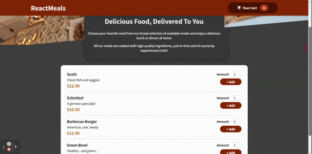

# Getting Started with Create React App

This project was developed in the Udemy Course [React - The Complete Guide (incl Hooks, React Router, Redux)](https://www.udemy.com/course/react-the-complete-guide-incl-redux/).

## Screenshot

## Available Scripts

In the project directory, you can run:

### `npm start`

Runs the app in the development mode.\
Open [http://localhost:3000](http://localhost:3000) to view it in your browser.

The page will reload when you make changes.\
You may also see any lint errors in the console.

### `npm test`

Launches the test runner in the interactive watch mode.\
See the section about [running tests](https://facebook.github.io/create-react-app/docs/running-tests) for more information.
